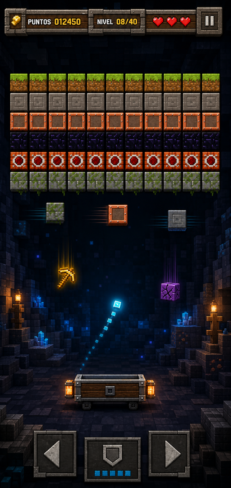

# Neon Breaker

Juego arcade mobile-first de romper bloques, creado con HTML5,
CSS y JavaScript puro sobre Canvas 2D. No requiere instalación, backend,
dependencias externas ni proceso de compilación.

**[Jugar en GitHub Pages](https://kokiperex.github.io/brick-smasher-mobile/)**



## Alcance implementado

- Canvas responsive para orientación vertical y horizontal.
- Pantalla de inicio.
- Plataforma controlable con touch, mouse, flechas y teclas A/D.
- Modos de control táctil directo y relativo con preferencia guardada.
- Una o varias bolas con colisiones contra paredes, plataforma y bloques.
- Rebote de la plataforma según la zona de contacto.
- Cuarenta niveles definitivos definidos como configuraciones de datos.
- Patrones únicos con bloques normales, reforzados, blindados, indestructibles,
  explosivos, móviles, regenerativos, sorpresa y jefe, todos con comportamiento
  funcional y representación visual propia.
- Curva calculada mediante `difficultyScore`.
- Tres vidas, puntuación y pérdida de vida.
- Pausa manual y pausa automática al ocultar la pestaña.
- Pantallas de nivel completado, fin de la fase y game over.
- Safe areas, prevención de scroll táctil y controles de al menos 44 px.
- Ajustes de sonido, vibración y modo de control.
- Progreso de campaña, puntuación máxima y última partida guardados localmente.
- Audio original sintetizado después de la primera interacción.
- Vibración opcional mediante `navigator.vibrate`.
- Cápsulas de premio y castigo que caen desde bloques destruidos.
- Premios: bola pegajosa, plataforma grande, multibola, disparos y bola lenta.
- Castigos: plataforma pequeña, aceleración, controles invertidos, oscuridad
  y plataforma resbaladiza.
- HUD con efectos activos y tiempo restante.
- Panel `?debug=1` para generar individualmente todos los objetos.

## Estructura

```text
index.html               Documento principal y HUD.
css/styles.css           Interfaz responsive y estilo visual.
js/game-loop.js          Reloj fijo y coordinación de actualización/render.
js/ball.js               Estado y lanzamiento de la bola.
js/paddle.js             Estado y movimiento suavizado de la plataforma.
js/brick.js              Entidad de bloque y metadatos de tipo/resistencia.
js/effect-catalog.js     Catálogo de los diez objetos y sus reglas.
js/falling-item.js       Entidad visual y física de una cápsula.
js/falling-object-system.js Generación, caída, recogida y multibola.
js/projectile.js         Entidad de proyectil de la plataforma.
js/collision-system.js   Detección y resolución de colisiones.
js/levels.js             Datos, análisis y score de los 40 niveles.
js/level-manager.js      Carga, avance y creación de niveles.
js/input-manager.js      Traducción de eventos touch/mouse al mundo.
js/effect-manager.js     Ciclo de vida y expiración de efectos temporales.
js/audio-manager.js      Audio original sintetizado con Web Audio API.
js/vibration-manager.js  Vibración opcional y detección de compatibilidad.
js/storage-manager.js    Lectura y escritura segura de datos locales.
js/game.js               Estados, reglas y renderizado del juego.
js/main.js               Inicialización de la aplicación.
tests/run-tests.js       Pruebas unitarias sin dependencias.
```

## Cómo abrir el juego

La forma directa es abrir `index.html` en un navegador moderno.

También puede servirse como sitio estático desde la raíz del proyecto:

```bash
python3 -m http.server 8080
```

Después visita `http://localhost:8080`.

## Controles

- Pulsa **JUGAR** para iniciar.
- Mueve el mouse o desliza un dedo horizontalmente para controlar la
  plataforma.
- Abre **⚙** para elegir control **Directo** o **Relativo**, sonido y
  vibración.
- En modo **Relativo**, arrastra desde cualquier zona para no tapar la
  plataforma con el dedo.
- Toca o haz clic en el área de juego para lanzar la bola.
- En escritorio, usa flechas o A/D para mover y Espacio para lanzar.
- Cuando esté activo **Disparos**, usa el botón **FUEGO**.
- Usa el botón **Ⅱ** para pausar y **CONTINUAR** para reanudar.

## Reglas de efectos

- Recoger nuevamente el mismo efecto reinicia su duración.
- Plataforma grande y pequeña se sustituyen mutuamente.
- Bola lenta y aceleración se sustituyen mutuamente.
- Multibola es instantáneo y respeta el máximo configurado por el nivel, hasta
  un límite global de cinco bolas.
- Solo puede permanecer activo un castigo temporal; recoger otro sustituye al
  anterior para evitar combinaciones imposibles.
- Una vida solo se pierde cuando caen todas las bolas.
- Todos los efectos, cápsulas y proyectiles se limpian al terminar un nivel.

## Modo debug

Abre `index.html?debug=1` o visita:

```text
http://localhost:8080/?debug=1
```

El panel contiene un generador para cada premio y castigo. Cada botón crea la
cápsula sobre la plataforma para que sea recogida. La utilidad **Completar
nivel** permite comprobar la limpieza y el inicio del siguiente nivel.

## Pruebas

Ejecuta desde la raíz del proyecto:

```bash
node tests/run-tests.js
```

La suite de 56 pruebas comprueba los 40 niveles, bloques rompibles, patrones duplicados,
fórmula y curva de dificultad, construcción de bloques, progresión de
velocidad, colisiones, reflexión, rebote en la plataforma,
velocidad de lanzamiento, condición de fin de nivel, paso fijo del loop y
expiración de efectos. También valida el catálogo completo, generación y
recogida de objetos, renovación, incompatibilidades, limpieza, proyectiles y
comportamiento multibola. Incluye regresiones para impactos de separación,
rebotes inferiores, trayectorias horizontales, resistencia y tipos avanzados,
captura táctil, teclado, accesibilidad, ciclo de vida, audio, guardado de
campaña y `SecurityError` de localStorage.

La fórmula, los símbolos y la tabla completa de scores están documentados en
`docs/LEVEL_DESIGN.md`.

Los tamaños auditados, hallazgos y validaciones móviles están documentados en
`docs/MOBILE_AUDIT.md`.

## Publicación en GitHub Pages

El juego utiliza rutas relativas y puede publicarse directamente desde la raíz
del repositorio:

1. Abre **Settings → Pages** en GitHub.
2. En **Build and deployment**, selecciona **Deploy from a branch**.
3. Elige la rama `main`, carpeta `/(root)` y pulsa **Save**.
4. Espera a que GitHub publique
   `https://kokiperex.github.io/brick-smasher-mobile/`.

No se necesita compilar ni instalar dependencias.

## Licencia

Este proyecto se distribuye bajo la [licencia MIT](LICENSE).
